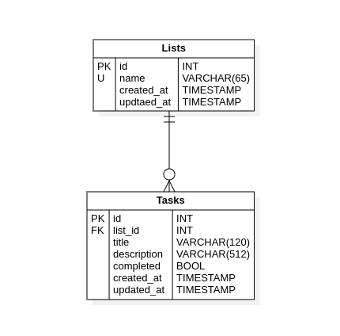

# Flight PHP API REST - to do list

---

<a name="contenido"></a>

<details>

<summary>Contenido</summary>

* [Introducción](#introduccion)
* [Requerimientos](#requerimientos)
* [Librerías](#librerias)
* [Descarga de repositorio](#repositorio)
* [Proyecto](#proyecto)
  * [Instalación de dependencias utilizando Composer](#composer)
  * [Exportar script sql a MySql](#mysql)
  * [Configuración de proyecto](#configuracion)
* [Servidor php](#servidor)

</details>

<a name="introduccion"></a>

## Introducción

Ejemplo sencillo utilizando el Framework php, **Flight PHP** con el fin de crear
una **Api REST** y el gestor de base de datos MySql.

[Contenido](#contenido)

<a name="requerimientos"></a>

## Requerimiento

* <a href="https://www.php.net/docs.php" target="_blank">Php 7.4 o superior</a>
* <a href="https://getcomposer.org/" target="_blank">Composer</a>
* <a href="https://dev.mysql.com/" target="_blank">MySql</a>

[Contenido](#contenido)

<a name="librerias"></a>

## Librerías

Librerías utilizadas.

* <a href="https://github.com/mikecao/flight" target="_blank">Flight PHP</a>
* <a href="https://github.com/phpenv/phpenv" target="_blank">Php ENV</a>

[Contenido](#contenido)

<a name="repositorio"></a>

## Descarga de repositorio

Clonamos el proyecto con SSH o HTTPS

```bash
# SSH
git clone git@github.com:igmr/FlightPHP-Api-REST-TodoList.git
```

O

```bash
# HTTPS
git clone https://github.com/igmr/FlightPHP-Api-REST-TodoList.git
```

Accedemos al proyecto

```bash
cd FlightPHP-Api-REST-TodoList
```

[Contenido](#contenido)

<a name="proyecto"></a>

## Configuración de proyecto

<a name="composer"></a>

### Instalación de dependencias utilizando Composer

Ejecutar el siguiente comando para descargar las dependencias necesarias
con el  administrador de dependencias Composer.

<a href="https://getcomposer.org/" target="_blank">Ver más sobre Composer</a>

```bash
# Descargar dependencias
composer update
```

[Contenido](#contenido)

<a name="mysql"></a>

### Exportar script sql a MySql

#### Modelo entidad relación



#### Importar y exportar script SQL

Para importar el script SQL hacia el gestor de base de datos MySql,
lo podemos realizar mediante PhpMyAdmin, workbench o desde la linea de comando.
El siguiente comando importa el script SQL a MySql.

```bash
# Sintaxis
mysql -u <user_name> -p<password> < <path/script/sql>

# O
mysql -u <user_name> -p < <path/script/sql>

# Ejemplo
mysql -u root -p < ./doc/script.sql
```

Para realizar la operación inversa usaremos el siguiente comando

```bash
# Sintaxis
mysqldump -u <user_name> -p<password> <database> > <path/script/sql>

# O
mysqldump -u <user_name> -p <database> > <path/script/sql>

# Ejemplo
mysqldump -u root -p FlightToDo > ./script.sql
```

[Contenido](#contenido)

<a name="configuracion"></a>

### Proyecto

Abrimos el proyecto en nuestro editor de código de preferencia

```bash
# Accedemos al proyecto
cd FlightPHP-Api-REST-TodoList
# Abrimos el proyecto con Visual Studio Code
code .
# O también podemos abrirlo con sublime text
subl .
```

Editamos el archivo de configuración. cambiando las credenciales de MySql ```./Config.php```

```php
<?php
//* *****************************************************************************
//* Configuración de base de datos            *
//* *****************************************************************************
Flight::set('host', 'localhost');
Flight::set('db', '');        // Nombre de base de datos
Flight::set('user', '');      // Usuario de acceso del gestor de base de datos
Flight::set('password', '');  // Contraseña de acceso del gestor de base e dato

```

<a name="servidor"></a>

### Servidor php

Para levantar el servidor ejecutamos el script

```bash
composer run-script dev
```

## Ver más

### Estructura del proyecto

```bash
.
├── .vscode
│   └── settings.json
├── doc
│   ├── ModelER-todo.png
│   └── script.sql
├── src
│   ├── model
│   │   ├── ListModel.php
│   │   └── TaskModel.php
│   └── service
│       ├── BaseService.php
│       ├── ListService.php
│       └── TaskService.php
├── vendor
│   └── ...
├── .gitignore
├── .htaccess
├── composer.json
├── Config.php
├── index.php
└── README.md

```

### Script SQL

```sql

-- * -----------------------------------------------------------------------
-- * Database FlightToDo
-- * -----------------------------------------------------------------------
DROP DATABASE IF EXISTS FlightToDo;
CREATE DATABASE IF NOT EXISTS FlightToDo;
USE FlightToDo;

-- * -----------------------------------------------------------------------
-- * Table Lists
-- * -----------------------------------------------------------------------
DROP TABLE IF EXISTS Lists;
CREATE TABLE IF NOT EXISTS Lists (
 id   INT   UNSIGNED NOT NULL     AUTO_INCREMENT COMMENT 'Primary key',
 name  VARCHAR(65)    NOT NULL         COMMENT 'Name list',
 created_at DATETIME    NOT NULL DEFAULT NOW()     COMMENT 'Audit',
 updated_at DATETIME     NULL DEFAULT NULL     COMMENT 'Audit',
 deleted_at DATETIME     NULL DEFAULT NULL     COMMENT 'Audit',
 CONSTRAINT pk_list  PRIMARY KEY (id),
 CONSTRAINT uk_id_list UNIQUE(id ASC) VISIBLE,
 CONSTRAINT uk_name_list UNIQUE(name ASC) VISIBLE
)ENGINE = InnoDB
COMMENT = 'Lists';

INSERT INTO Lists(name, created_at)
VALUES
 ('Todos', NOW()),
 ('Proyecto FlightPHP - todo', NOW()),
 ('Lista 02', NOW()),
 ('Lista 03', NOW()),
 ('Lista 04', NOW()),
 ('Lista 05', NOW()),
 ('Lista 06', NOW()),
 ('Lista 07', NOW()),
 ('Lista 08', NOW()),
 ('Lista 09', NOW()),
 ('Lista 10', NOW());

-- * -----------------------------------------------------------------------
-- * Table Tasks
-- * -----------------------------------------------------------------------
DROP TABLE IF EXISTS Tasks;
CREATE TABLE IF NOT EXISTS Tasks (
 id   INT   UNSIGNED NOT NULL     AUTO_INCREMENT COMMENT 'Primary key',
 list_id  INT   UNSIGNED  NULL DEFAULT 1      COMMENT 'Foreign key',
 title  VARCHAR(120)   NOT NULL         COMMENT 'title task',
 description VARCHAR(512)    NULL DEFAULT NULL     COMMENT 'description task',
 completed TINYINT     NOT NULL DEFAULT 0      COMMENT 'It is completed?',
 created_at DATETIME    NOT NULL DEFAULT NOW()     COMMENT 'Audit',
 updated_at DATETIME     NULL DEFAULT NULL     COMMENT 'Audit',
 deleted_at DATETIME     NULL DEFAULT NULL     COMMENT 'Audit',
 CONSTRAINT pk_tasks    PRIMARY KEY (id),
 CONSTRAINT uk_id_tasks   UNIQUE(id ASC) VISIBLE,
 CONSTRAINT fk_tasks_lists  FOREIGN KEY (list_id)
  REFERENCES Lists (id) ON DELETE NO ACTION ON UPDATE NO ACTION
)
ENGINE = InnoDB
COMMENT = 'List task';

INSERT INTO Tasks(list_id, title, description, completed, created_at)
VALUES
 (1, 'predeterminado'
  , NULL, true, NOW()),
 (2, 'Creamos un directorio para la API REST con el Framework Flightphp'
  , NULL, false, NOW()),
 (2, 'Accedemos al directorio'
  , NULL, false, NOW()),
 (2, 'Instalamos el framework flightphp mediante composer'
  , NULL, false, NOW()),
 (2, 'Creamos el archivo .htaccess'
  , null, false, NOW()),
 (2, 'Creamos el archivo index.php'
  , null, false, NOW()),
 (2, 'Creamos una ruta de prueba'
  , null, false, NOW()),
 (2, 'Importamos script sql a MySql local desde una terminal'
  , null, false, NOW()),
 (2, 'Creamos el archivo de configuracion'
  , null, false, NOW()),
 (2, 'Configuramos la conexion hacia la base de datos MySql desde el archivo index.php'
  , null, false, NOW()),
 (2, 'Creamos estructura de carpetas'
  , null, false, NOW()),
 (2, 'Creamos y configuramos el archivo baseService.php'
  , null, false, NOW()),
 (2, 'Construir modulo de lista'
  , null, false, NOW()),
 (2, 'Construir modulo de tareas'
  , null, false, NOW()),
 (2, 'Creamos base datos desde hosting'
  ,null, false, NOW()),
 (2, 'Generamos script sql desde MySql local'
  ,null, false, NOW()),
 (2, 'Importamos script sql hacia base de datos del hosting'
  ,null, false, NOW()),
 (2, 'Subimos proyecto a Hosting'
  ,null, false, NOW()),
 (2, 'Modificamos los datos de conexion locales por los del hosting'
  ,null, false, NOW());
```
